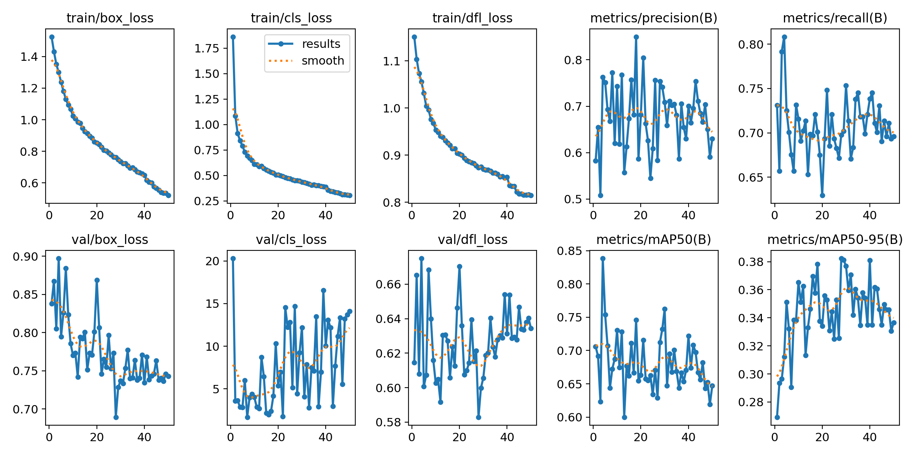
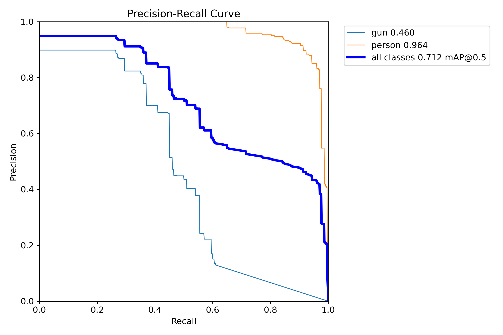
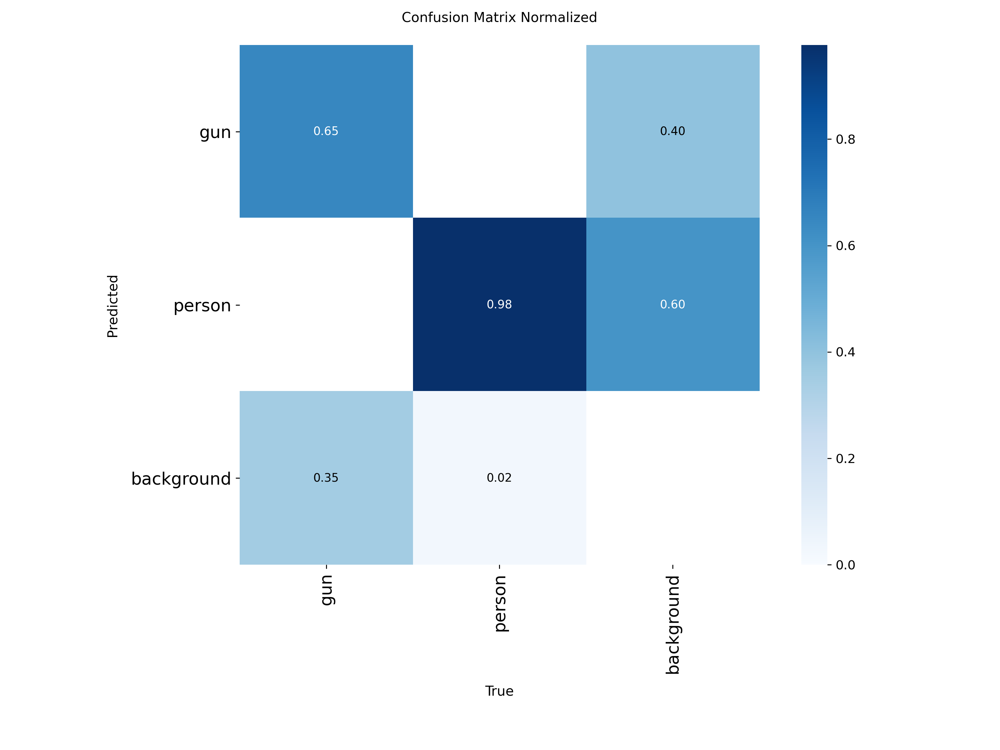
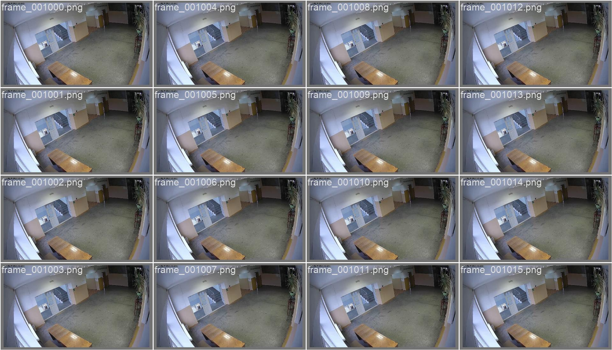

# Детекция оружия и людей на видеопотоке (YOLOv8)

## Задача

**Цель курсовой работы** — разработать систему компьютерного зрения для обнаружения **оружия** и **человека** на видеопотоке с камер вуза.

Проект выполнен в рамках **учебной курсовой работы**. В перспективе (магистерская работа) планируется:

- расширение на распознавание **многих видов оружия**;
- детекция **курения**;
- детекция **вандальных действий** (рисование на стене, драки);
- интеграция в **вузовскую систему управления камерами** для быстрого реагирования в **реальном времени**.

---

## О проекте

Система использует нейросеть **YOLOv8** (Ultralytics) для детекции двух классов:

| ID | Класс   | Описание              |
|----|---------|-----------------------|
| 0  | `gun`   | Оружие                |
| 1  | `person`| Человек               |

**Датасет** собран самостоятельно с помощью камер вуза. Разметка выполнена **вручную в CVAT** и экспортирована в формат YOLO.

- Обучающая выборка: **5378** кадров
- Валидационная выборка: **712** кадров
- Всего: **~6090** размеченных кадров

---

## Технологии

- **Python 3.10+**
- **PyTorch** — фреймворк глубокого обучения
- **Ultralytics YOLOv8** — архитектура детекции объектов
- **OpenCV** — обработка видео и webcam
- **CVAT** — ручная разметка датасета

---

## Структура проекта

```
gun_detection/
├── README.md
├── requirements.txt
├── main.py                 # Единая точка входа (prepare / train / detect / realtime)
├── train.py                # Обучение модели YOLOv8
├── detect_video.py         # Детекция на видео и webcam
├── test.py                 # Проверка установки PyTorch и CUDA
├── data/
│   ├── data.yaml           # Конфигурация датасета для YOLO
│   ├── images/
│   │   ├── train/          # Обучающие изображения
│   │   └── val/            # Валидационные изображения
│   └── labels/
│       ├── train/          # YOLO-метки (train)
│       └── val/            # YOLO-метки (val)
├── models/
│   └── best.pt             # Лучшие веса после обучения
├── docs/
│   └── training/           # Графики обучения для отчёта
├── outputs/                # Результаты детекции на видео
├── video/
│   ├── video_gun1.mp4      # Исходное тестовое видео
│   └── detected.mp4        # Видео для демонстрации детекции
└── utils/
    └── dataset_preparation.py
```

---

## Установка

### 1. Клонирование репозитория

```bash
git clone <url-репозитория>
cd gun_detection
```

### 2. Создание виртуального окружения (рекомендуется)

```bash
python -m venv venv
venv\Scripts\activate        # Windows
# source venv/bin/activate   # Linux/macOS
```

### 3. Установка зависимостей

```bash
pip install -r requirements.txt
```

### 4. PyTorch с поддержкой GPU (CUDA)

**Важно:** стандартный `pip install torch` ставит CPU-версию. Для обучения на видеокарте нужна сборка с CUDA.

Проверка текущей установки:

```bash
python test.py
```

Если `CUDA available: False`, переустановите PyTorch (пример для CUDA 12.4):

```bash
pip uninstall torch torchvision torchaudio -y
pip install torch torchvision --index-url https://download.pytorch.org/whl/cu124
```

Актуальные команды для вашей версии CUDA: [pytorch.org](https://pytorch.org/get-started/locally/)

После установки `python test.py` должен показать имя GPU (например, NVIDIA GeForce GTX 1660).

### 5. Проверка установки

```bash
python test.py
```

Ожидаемый вывод при наличии GPU:

```
PyTorch version: 2.x.x
CUDA available: True
```

---

## Использование

### Подготовка датасета

Если данные ещё не в формате YOLO (train/val), выполните миграцию:

```bash
python main.py --mode prepare
```

### Обучение модели

```bash
python main.py --mode train --epochs 100
# явный batch (если нужно ещё больше VRAM):
python main.py --mode train --epochs 100 --batch 24
```

Параметры обучения по умолчанию:

- Модель: `yolov8n.pt` (nano — быстрая, подходит для realtime)
- Размер изображения: 640 px
- Batch: 24 для GPU 6 GB (GTX 1660), автоматически подбирается под VRAM
- Early stopping: patience 30

После обучения лучшие веса сохраняются в `models/best.pt`.

Альтернативный запуск:

```bash
python train.py
```

### Детекция на видео

```bash
python main.py --mode detect --video video/detected.mp4
```

Результат сохраняется в `outputs/detected_detected.mp4`.

Другой пример:

```bash
python main.py --mode detect --video video/video_gun1.mp4
```

Результат сохраняется в `outputs/video_gun1_detected.mp4`.

С отображением превью:

```bash
python main.py --mode detect --video video/video_gun1.mp4 --show
```

Прямой запуск через `detect_video.py`:

```bash
python detect_video.py --video video/video_gun1.mp4 --model models/best.pt --output outputs/video_gun1_detected.mp4
```

### Детекция в реальном времени (webcam)

```bash
python main.py --mode realtime
```

---

## Результаты обучения

### Параметры эксперимента `gun_person_v1`

| Параметр | Значение |
|----------|----------|
| Модель | YOLOv8n (`yolov8n.pt`) |
| Эпохи | 50 |
| Batch size | 8 |
| Размер изображения | 640 px |
| GPU | NVIDIA GeForce GTX 1660 (6 GB) |
| Время обучения | ~3.2 ч (11 663 с) |
| Датасет | 5378 train / 712 val |

Полные логи и веса: `runs/detect/runs/train/gun_person_v1/`.

### Метрики на валидации (лучшая модель `models/best.pt`)

| Класс | Precision | Recall | mAP50 | mAP50-95 |
|-------|-----------|--------|-------|----------|
| **all** | 0.750 | 0.698 | **0.712** | **0.383** |
| gun | 0.652 | 0.450 | 0.460 | 0.141 |
| person | 0.848 | 0.946 | 0.964 | 0.624 |

Скорость инференса на GPU: **~2.9 ms** на изображение (preprocess + inference + postprocess).

**Выводы:**

- Класс **person** детектируется уверенно (mAP50 = 0.964, recall = 0.946).
- Класс **gun** сложнее: меньше примеров в кадре, мелкий объект, recall = 0.45 — основная зона для улучшения на магистерской работе.
- Общий mAP50 = **0.712** — приемлемый результат для учебной курсовой на собственном датасете.

### Графики обучения

> Графики лежат в папке [`docs/training/`](docs/training/).  
> Если в предпросмотре README картинки не видны — откройте файлы напрямую (двойной клик в проводнике или через ссылки ниже). На GitHub картинки появятся после `git add docs/training` и push.

Кривые loss и метрик по эпохам:



[Открыть results.png](./docs/training/results.png)

Precision–Recall кривая:



[Открыть BoxPR_curve.png](./docs/training/BoxPR_curve.png)

Нормализованная матрица ошибок:



[Открыть confusion_matrix_normalized.png](./docs/training/confusion_matrix_normalized.png)

Пример предсказаний на валидации:



[Открыть val_batch0_pred.jpg](./docs/training/val_batch0_pred.jpg)

---

## Результаты детекции на видео

Демонстрация на `video/detected.mp4` (1920×1080, 30 FPS, 1286 кадров):

```bash
python main.py --mode detect --video video/detected.mp4
```

Результат сохранён в **`outputs/detected_detected.mp4`**.

| Показатель | Значение |
|------------|----------|
| Кадров обработано | 1286 |
| Время обработки | 34.9 с |
| Средний FPS | 36.9 |
| Детекций gun | 799 |
| Детекций person | 6082 |

На выходном видео:

- красные bounding box — **gun** (оружие);
- зелёные bounding box — **person** (человек);
- счётчики детекций на каждом кадре.

---


## Планы развития

| Этап | Описание |
|------|----------|
| Курсовая (текущий) | Детекция gun + person, YOLOv8n |
| Магистерская | Больше классов оружия, курение, вандализм |
| Продакшен | Интеграция в систему камер вуза, inference в реальном времени |

---

## Лицензия

Учебный проект. Использование — в образовательных целях.
